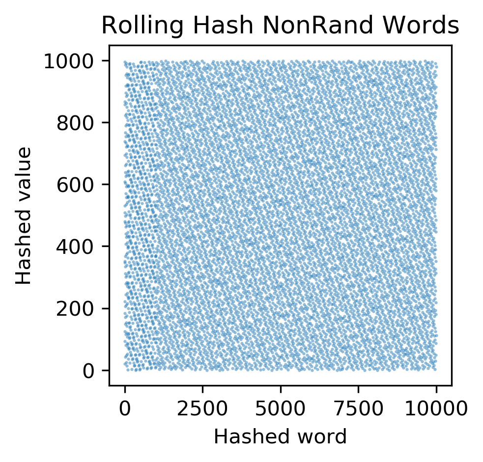

# Hash tables

## Modules, Scripts, and Shell Files
hash_functions.py: contains three types of hash functions --> ascii, rolling, and the default python hash functions.  The user can specify inputs to run this function.

hash_tables.py: uses hash_functions to create hash tables, includes different collision resolution strategies

hash_tests.sh: Contains the experiments I did to test the properties of my has functions and collision resolution strategies, more information on that below

test_hash_functions.py: unittests for the hash functions

scatter.py: a plotting function that Dr. Layer is letting us use for this assignment

.txt files: inputs for the hash functions given by Dr. Layer

.png files: results of hash_tests. more info below

## Hash Experiments
All the experiments run in this section are included in the hash_test.sh file.  Therefore, in order to run the tests yourself, all you need to do is
```
chmod +x hash_tests.sh
./hash_tests.sh
```
and it will produce all of the figures below.
### Experimenting with Distributions
First I ran experiments looking at the distributions created by the various hash functions methods.  Below are the plots of my results followed by a summary of the trends I see.  The titles of the plots indicate the condition for the test. Ascii or Rolling refers to the type of hash function.  Rand vs NonRand refers to the type of input that the hash functions was given.




As we can see from the above plots, there are clear patterns in the distributions for the Ascii Rand case and all the NonRand cases.  The Ascii Non Rand is particularly bad.  However, we want as random of a distribution as possible and don't want to see patterns in these plots.  Therefore the Rolling Rand case is ideal because it has the most random and uniform distribution.  Going forward, I used the Rolling Rand case to test the collision resolution strategies as it had the best distribution.
### Experimenting with Collision Resolution
Next, I ran a few different tests on collision resolution strategies.  I benchmarked my results and plotted them as a function of the load factor which is defined as M/N where M is the number of elements and N is the size of the hash table.  Belowe are the plots produced by these tests. All tests use the Rolling Rand hash function and input but the title of the plot specifies the collision resolution strategy (either linear or chain) and if it used add or search.


Ideally, we would want the time taken to perform these operations to not dramatically increase with load factor, as we may expect to have a large number of elements, M, that would be out of our control.  In Rolling Linear Add, we see that the time increases dramatically for larger load factor -- this is not ideal.  Additionally, for Rolling Linear Search, the time it takes to execute is large for small load factors, which is also non ideal.  Overall the techniques involving Rolling and Chain are more uniform in the time it takes per load factor. Rolling Chain Add seems to have some kind of vaguely perodic load factor values that take particularly long to peform.  From an overall numbers perspective Rolling Chain Search takes the least amount of time per load factor.  Therefore Rolling Chain Search is the ideal method for these purposes.

## Running Files

In order to make the shell files executable, run
```
chmod +x functional_tests.sh
```
and 
```
chmod +x hash_tests.sh
```
then use 
```
./functional_tests.sh
```
and 
```
./hash_tests.sh
```
to run the shell files respectively

hash_function.py can be run from the command line and needs user specified inputs in the following order (1) size of array (2) hash type

hash_tables.py can be run from the command line and needs user specified inputs in the following order (1) size of array (2) hash type (3) collision resolutions strategy (4) input file name (5) number of keys to add
## Example

An example of running hash_function.py is 
```
python hash_functions.py rand_words.txt ascii
```
An example of running hash_tables.py is 
```
python hash_tables.py 1000 ascii linear rand_words.txt 2
```
An example of running scatter.py is 
```
python hash_functions.py rand_words.txt ascii | python scatter.py ascii_hash_rand.png "Hashed word" "Hashed value" "Ascii Hash Rand Words"
```

